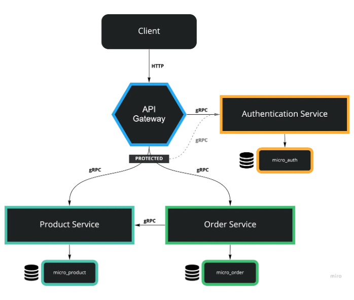

### 服务架构

考虑到只有一个人维护，实现为以单个http服务的架构，实现参考 [NestJS: Microservices with gRPC, API Gateway, and Authentication](https://levelup.gitconnected.com/nestjs-microservices-with-grpc-api-gateway-and-authentication-part-1-2-650009c03686)

- Api Gateway: 实现jwt，限流、Swagger等与客户端交互的工具服务
- Order Service: 实现订单相关的业务逻辑

